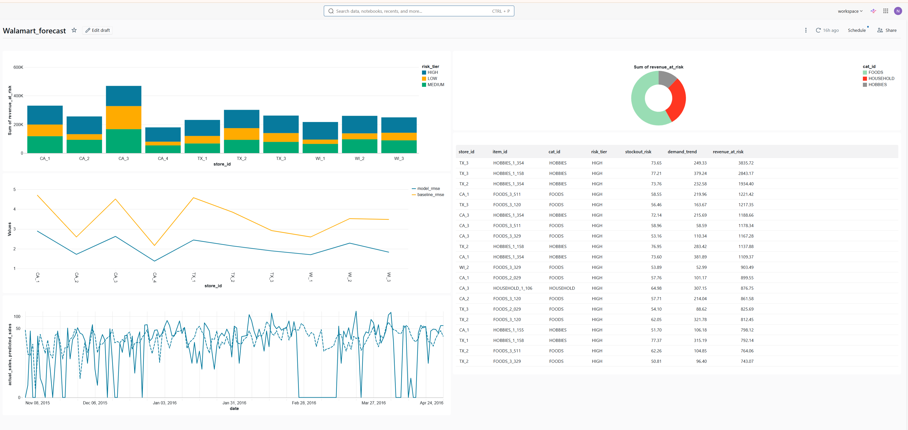
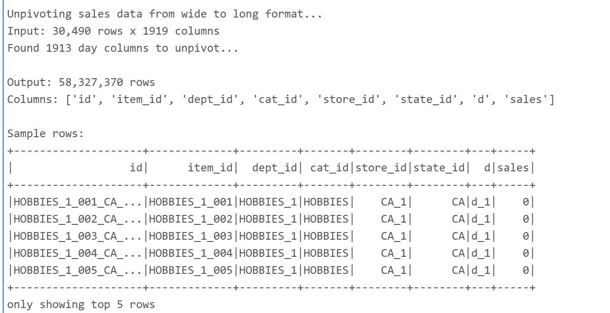
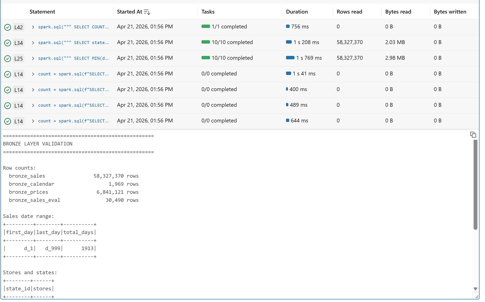
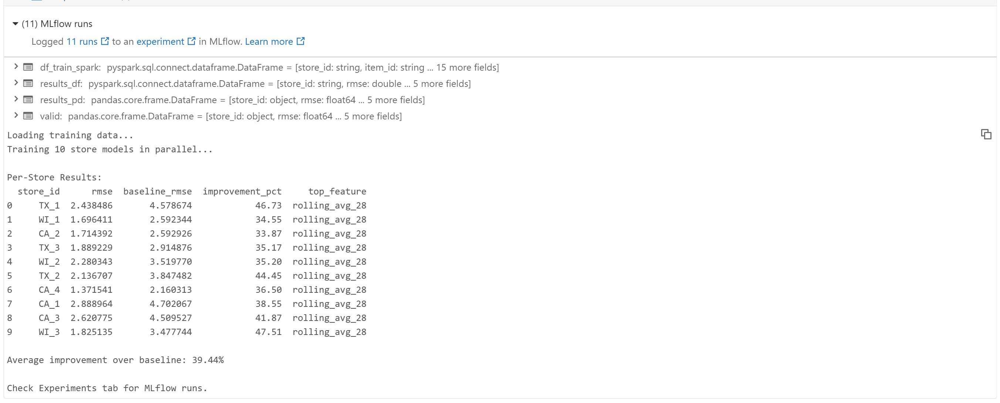
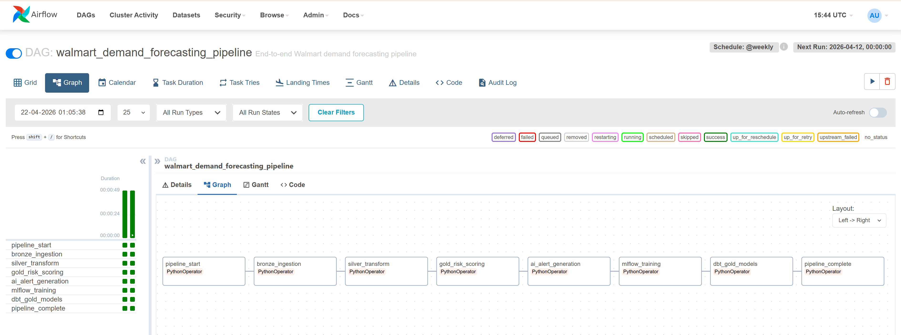

# Walmart Demand Intelligence Platform

### Production-Grade Lakehouse Pipeline

---

## Why This Project Exists

Walmart's 2025 Annual Report disclosed to the SEC that inventory forecasting inaccuracy represents a material financial risk against a $64.5 billion inventory base. A 0.5% improvement in inventory accuracy translates to $274 million in COGS reduction.

This project builds a production-grade demand forecasting and inventory risk intelligence system directly addressing that disclosed risk — using Walmart's own M5 dataset processed at lakehouse scale on Databricks.

---

## Results

| Metric | Value |
|--------|-------|
| Raw rows processed | 58,327,370 across 4 Delta tables |
| Features engineered | 25 lag, rolling, price, and event signals |
| Store-item risk profiles | 30,490 scored |
| Revenue at risk quantified | $2.75M across 10 stores |
| Store models trained in parallel | 10 XGBoost models via PySpark applyInPandas |
| Average RMSE improvement | 39.44% over naive baseline |
| Best store improvement | 47.51% — WI_3 |
| AI alerts generated | 5 plain-English Llama 3 alerts |
| dbt data quality tests | 11 of 11 passing |
| Pipeline schedule | 8-task Airflow DAG running weekly |

---

## Dashboard

---

## Pipeline

**Bronze → Silver → Gold → AI → MLflow → dbt → Airflow**

### Bronze — Raw Ingestion

Ingested 4 M5 Walmart CSV files via Kaggle API directly into Databricks. The sales file arrives in wide format — 30,490 rows × 1,913 day-columns. A PySpark stack() unpivot transforms this into 58,327,370 properly structured rows. All files written as ACID-compliant Delta tables.

| Table | Rows |
|-------|------|
| bronze_sales | 58,327,370 |
| bronze_calendar | 1,969 |
| bronze_prices | 6,841,121 |
| bronze_sales_eval | 30,490 |

### Silver — Feature Engineering

Joined all 3 Bronze tables and engineered 25 features. Zero null values in any feature.

| Feature | Purpose |
|---------|---------|
| lag_7, lag_28, lag_364 | Short, medium, and seasonal demand memory |
| rolling_avg_28, rolling_avg_91 | Trend smoothing |
| category_avg_28 | Store-category momentum signal |
| price_change_pct | Promotion detection — % change vs prior week |
| snap_flag | Food stamp payment day signal |
| has_event | Super Bowl, Valentine's Day, NBA Finals |

### Gold — Inventory Risk Intelligence

Aggregated 58M rows into 30,490 store-item risk profiles. Each profile includes stockout risk score, demand trend, revenue at risk, and risk tier classification.

Total revenue at risk identified: **$2,756,948** across 10 stores.

### AI Layer — Llama 3 Alerts

Top 5 highest-revenue-at-risk items piped through Llama 3 70B via Databricks Mosaic AI. The LLM converts quantitative risk scores into plain-English alerts with specific unit recommendations — output a store manager can act on without reading a dashboard.

[View full AI alerts](ai_alerts_sample.md)

### MLflow — Parallel Store Models

Trained 10 store-specific XGBoost models in parallel using PySpark applyInPandas — one model per store, each logged independently in MLflow.

| Store | RMSE | Baseline | Improvement |
|-------|------|----------|-------------|
| WI_3 | 1.825 | 3.478 | 47.51% |
| TX_1 | 2.438 | 4.579 | 46.73% |
| TX_2 | 2.137 | 3.847 | 44.45% |
| CA_3 | 2.621 | 4.510 | 41.87% |
| CA_1 | 2.889 | 4.702 | 38.55% |

Top feature across all 10 stores: **rolling_avg_28**

### dbt — Production SQL Models
models/gold/
├── gold_store_risk.sql
├── gold_model_performance.sql
├── gold_ai_alerts_enriched.sql
└── schema.yml

**PASS=11 WARN=0 ERROR=0**

Tests include not_null, unique, and accepted_values for risk_tier and model_grade.

### Airflow — Weekly Orchestration

8-task DAG scheduled weekly orchestrating the full pipeline end-to-end.

---

## Repository Structure
walmart-demand-forecasting/
├── notebooks/
│   ├── 01_bronze_ingestion.ipynb
│   └── 02_silver_layer.ipynb
├── dbt/models/gold/
│   ├── gold_store_risk.sql
│   ├── gold_model_performance.sql
│   ├── gold_ai_alerts_enriched.sql
│   └── schema.yml
├── airflow/dags/
│   └── walmart_pipeline.py
├── screenshots/
├── ai_alerts_sample.md
└── README.md

---

## Interview Talking Points

**Why PySpark instead of pandas?**
58 million rows after unpivoting the wide-format sales file. Pandas would require 4GB RAM and struggle with window functions at this scale. Spark distributed the compute, completing the unpivot in under 30 seconds.

**Why per-store models instead of one global model?**
CA stores in urban California have fundamentally different demand patterns than WI stores in Wisconsin. A global model averages these out and loses signal. applyInPandas trained 10 models in parallel — same compute time, 10x the specificity.

**Why the LLM layer?**
Risk scores are numbers. Store managers act on sentences. Llama 3 converts quantitative output into specific, actionable alerts with unit recommendations. That is the last-mile delivery problem in data products.

**What does dbt add that raw SQL does not?**
Version control, automated testing, and lineage documentation. Every Gold table has column-level tests that run on every pipeline execution. If risk_tier ever contains a value outside HIGH/MEDIUM/LOW, the pipeline fails immediately.

---

## Contact
**Navin Kumar Nagisetty** — Fairfield, CT

